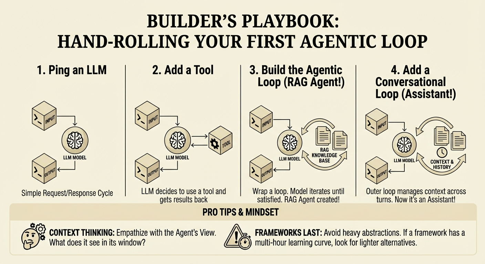

# Agentic Loop

Build an agentic loop from scratch, following John Berryman's "Builder's Playbook" homework.



## Setup

```bash
# Install dependencies
uv sync

# Copy and fill in your API keys
cp .env.example .env
```

Required keys:
- `GEMINI_API_KEY` - from Google AI Studio
- `EXA_API_KEY` - from exa.ai

## The Scripts

Each script builds on the previous one:

### 01_ping_llm.py
Basic LLM call. Text in, text out.
```bash
uv run python 01_ping_llm.py
uv run python 01_ping_llm.py "What is the capital of France?"
```

### 02_add_tool.py
Add a search tool. Model can call Exa to search the web, then answers based on results.
```bash
uv run python 02_add_tool.py
uv run python 02_add_tool.py "Who is John Berryman the search expert?"
```

### 03_agentic_loop.py
Wrap in a loop. Model searches as many times as needed until satisfied.
```bash
uv run python 03_agentic_loop.py
uv run python 03_agentic_loop.py "Compare Elasticsearch and Solr"
```

### 04_conversation_loop.py
Add multi-turn conversation. Context persists across turns.
```bash
uv run python 04_conversation_loop.py
```
Type `quit` to exit.

## Key Concepts

- **Grounding**: System prompt forces the model to search rather than answer from weights (reduces hallucination)
- **Agentic loop**: Model decides when to stop - responds with tool calls until it has enough info, then responds with text
- **Context accumulation**: Messages grow with each turn - this works for short conversations but would need management for longer ones

## TODO

- [ ] Upgrade to Gemini 3 Flash (currently using Gemini 2.0 Flash)
- [ ] Clean up Gemini boilerplate into helpers (the `types.Content`/`types.Part` verbosity obscures the core loop logic)
- [ ] Add examples using OpenAI or Anthropic APIs for comparison

## See Also

`plan.md` - the design doc for this project
